# Human-Centered-Design

## 💬 Interview met Marie van Driessche
Voor onze eerste ontmoeting met Marie hadden we van iedereen met dezelfde case vragen verzameld voor een interview.

### Vragen
- Ben je doof geboren of doof geworden?
- Waar komt je passie voor podcasts of films vandaan?
- Wat voor podcasts en films kijk je?
- Wat gebruik je nu wanneer je een podcast of film kijkt / Hoe en waar kijk je films of podcasts?
- Wat vind je daar fijn aan werken?
- Wat vind je van de huidige *closed caption* en wat mis je?
- Wat is je favoriete film, waarom en hoe kan deze nog beter worden?
- Wat mis je het meest in de ervaring als je naar een film of podcast kijkt?
- Zouden trillingen kunnen helpen met het begrijpen van de muziek?
- Begrijp je de huidige muziek/effecten die worden omschreven in de ondertiteling zoals [spannende muziek] of [er wordt geklopt]?

### Aantekeningen
| 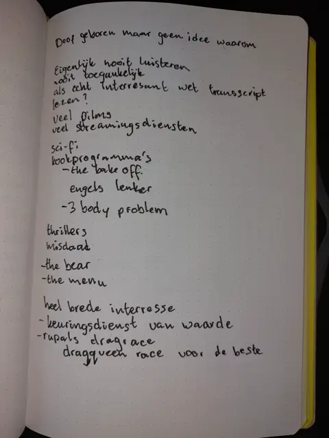 | 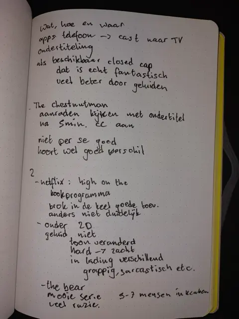 | 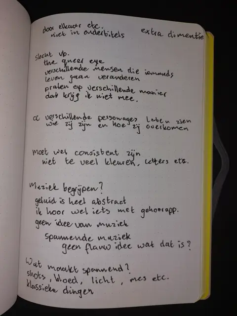 |
| --- | --- | --- |
| 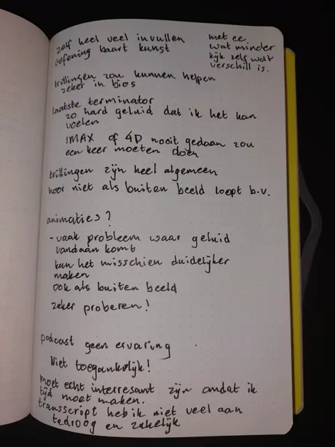 | 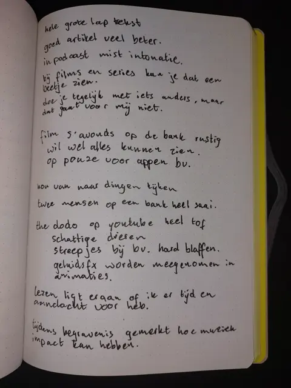 | |

### Belangrijkste bevindingen

#### Over Marie
- Marie is doof geboren
- Marie kijkt veel films en series
- Marie heeft veel verschillende streamingdiensten
- Marie heeft een brede interesse en kijkt graag naar science fiction, thrillers en misdaad films. Daarnaast kijkt ze graag kookprogramma's.

- Series en films die Marie kijkt zijn onder andere:
	- *The Bake Off*
	- *3 Body Problem*
	- *The Bear*
	- *The Menu*
	- *Rupauls Drag Race*
	- *The Chestnut Man*

#### Hoe & Waar
Marie gebruikt haar telefoon om naar haar tv te casten. Ze kijkt films met ondertiteling en als dat beschikbaar is met ***closed captions***. *Closed captions* is ondertiteling, maar dan met beschrijvingen van geluiden er bij. Als het goed is gedaan, is dit voor Marie fantastisch. Een goed voorbeeld is volgens Marie *The Chestnut Man*. Ze raadt aan om het eerst met gewone ondertiteling te kijken en vervolgens met *closed captions*, zo kan je goed zien wat het verschil is. Sowieso moet je zelf heel veel invullen en met *closed captions* is dit want minder.

#### Het verschil tussen ondertiteling en geluid
Marie beschrijft ondertiteling als 2 dimensionaal, waar geluid volgens haar veel meer is. Binnen een zin kan de toon veranderen, het kan van hard naar zacht gaan en je kan verschil in lading horen. Of iets grappig of serieus is bedoeld kan je aan ondertiteling niet zien. Marie neemt de serie *The Bear* als voorbeeld. Er komen veel ruzies in voor waarbij mensen door elkaar praten, maar in de ondertiteling is alles juist netjes onder elkaar gezet. “Hierin mist die extra dimensie”, zegt Marie. “Het zou mooi zijn als ik de sfeer of intonatie van sprekers mee kan krijgen.”

#### Muziek
Geluid is voor Marie iets heel abstracts. Ze heeft geen idee wat muziek is. Van ondertitels als “[spannende muziek]”, heeft ze dus geen flauw idee wat dat is. “Wat maakt muziek spannend”, vraag Marie zich af. Wat voor haar wel een film spannend maakt, heeft te maken met het beeld (de shots, belichting) en klassieke dingen in het beeld (iemand die met een mes loopt, bloed, etc.). Hoewel Marie niet weet wat muziek is, weet ze wel hoeveel impact het op mensen kan hebben. Als voorbeeld geeft ze de begrafenis van haar opa, waarbij de familie op een gegeven moment bij een bepaald stuk in de muziek moest huilen.

#### Podcasts
Podcast kijkt Marie eigenlijk nooit naar. Het is gewoon niet toegankelijk. Twee mensen die met elkaar praten is met ondertiteling te saai. De andere optie is het transscript lezen, maar dit is een lange lap spreektekst. Het moet echt heel interessant zijn voordat Marie dit helemaal gaat lezen. Het is vaak veel te droog en zakelijk. Een goed artikel is veel beter.

#### Wat ideeën
*“Zouden trillingen helpen bij het begrijpen van de muziek?”*
Marie komt hier later op terug met: “Trillingen zouden kunnen helpen. Zeker in de bios!” Ze vertelt dat toen ze *Terminator 2* in de bioscoop zag, het geluid zo hard stond dat ze het kon voelen. Wel zijn trillingen heel algemeen. Waar het volgens Marie misschien gebruikt kan worden is bij schoten, of als iemand buiten beeld loopt, omdat dit alleen op geluid gebaseerd is kan ze dit helemaal niet mee krijgen.

*“Zouden animaties van geluiden in een overlay kunnen helpen, of lees je liever in beschrijving?”*
Voor Marie lijkt dit door één reden wel een goed idee: vaak is het niet duidelijk waar geluid vandaan komt. Dit kan het misschien duidelijker maken, ook als het van buiten beeld komt. Ze vindt het zeker iets om te proberen.


## *User Trip*: *Closed Captions* proberen
Om te ervaren hoe het voor Marie is om een film te kijken heb ik zelf een stukje van de serie *The Chestnut Man* gekeken. Eerst met alleen normale ondertiteling, daarna met *closed captions* en als laatste nog met geluid om te zien wat ik gemist had. De bevindingen hieronder zijn wat ik er uit heb gehaald. Natuurlijk weet ik niet hoe dit voor Marie is, omdat geluid voor haar zo'n abstract idee is.

### Bevindingen
- Veel geluiden bedenk je zelf bij het beeld, omdat je de bron in beeld ziet. Als je een autodeur ziet dichtslaan, bedenk je dat dit een klap moet geven.
- Delen waar de spannende muziek de belangrijkste bron is, worden heel saai en langdurig zonder muziek.
- Het is soms onduidelijk wie wat zegt.
- Emoties komen niet over doordat intonatie en tempo van spreken niet is af te lezen aan de *closed captions*.
- Dingen die buiten beeld gebeuren en alleen te horen zijn, komen niet goed over als de geluiden omschreven zijn. De *cliffhanger* aan het eind van de openingsscene krijg je bijvoorbeeld niet goed mee omdat de opbouw alleen in het geluid plaatsvindt.


## Hoe werkt *closed caption*?
Volgens MDN ([MDN, 2024](https://developer.mozilla.org/en-US/docs/Web/HTML/Element/track)) kan je bij webvideo’s ondertiteling of *closed captions* toevoegen met het ```<track>``` element. Hiermee kan een ondertitelingsbestand worden gekoppeld aan een video. Hierin geef je met attributen aan wat voor bestand het is.

Gebruik:
- ```kind``` voor het soort. Kan *subtitles*, *captions*, *descriptions*, *chapter* of *metadata* zijn.
- ```label``` voor de naam van de *track* die voor de gebruiker zichtbaar is.
- ```src``` voor het bestand.
- ```srclang``` voor de taal van het bestand.

Er kunnen meerdere tracks in bijvoorbeeld meerdere talen of van verschillende soorten worden toegevoegd:

```html
<video controls poster="/images/sample.gif">
  <source src="sample.mp4" type="video/mp4" />
  <track kind="captions" src="sampleCaptions.vtt" srclang="en" />
  <track kind="subtitles" src="sampleSubtitles_de.vtt" srclang="de" />
  <track kind="subtitles" src="sampleSubtitles_en.vtt" srclang="en" />
</video>
```

Het formaat voor een ondertitelingsbestand voor web is **WebVVT**. In de basis is dit hetzelfde als ondertiteling voor bijvoorbeeld op dvd’s, maar er blijkt nog veel meer mogelijk te zijn, wat ik eigenlijk nog nooit eerder gebruikt heb zien worden.

Je kan zowel in het *vvt* bestand als in *CSS* elke lijn van de ondertiteling apart stijlen.

*Inline*:
```vvt
00:00:05.000 --> 00:00:10.000 position:20% size:60% align:start
- Some time ago in a place rather distant....
```

In *CSS*:
```css
::cue(#cue-identifier) {
  color: red;
}
```
Bron: [MDN, 2023](https://developer.mozilla.org/en-US/docs/Web/API/WebVTT_API#styling_webvtt_cues)


## Eerste prototype

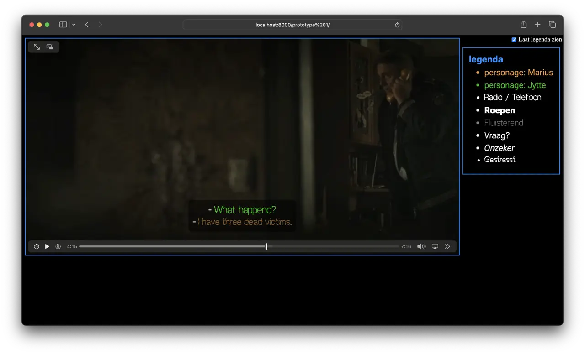

[Bekijk het prototype](https://joppekoops.github.io/Human-Centered-Design/prototype%201/)

Voor dit eerste prototype heb ik met *WebVTT* geprobeerd de emoties van de personages beter duidelijk te maken in de ondertiteling door gebruik van lettertypes en kleuren. Om duidelijk te maken welk personage wat zegt, heb ik per personage één kleur uitgekozen. Voor de emoties was het idee om die uit te drukken in het lettertype. Hiervoor gebruik ik verschillende lettertypes, waaronder één variabele met veel mogelijkheden.

Origineel wilde ik nog meer variaties maken met ```letter-spacing```, ```font-size```, ```text-transform``` etc. Helaas blijkt *vtt* toch wat minder goed vorm te geven dan ik had gedacht en werken al deze *properties* niet.

Op het laatst heb ik nog gauw een legenda toegevoegd met de betekenissen van de verschillende letters:

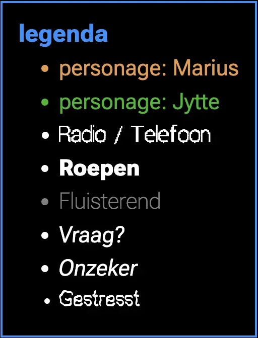

Als iets niet helemaal duidelijk is hier snel te zien wat er bedoeld wordt.

Naast de mogelijkheden uit de legenda kunnen ook verschillende versies worden gecombineerd, waardoor een combinatie van emoties duidelijk zou moeten worden.


## User test 1 (10-04-2024)

### Test plan
1. Het idee is om eerst de scene te kijken zonder eerst de betekenis van de verschillende letters te weten.
2. Waarna Marie verteld wat ze ervan vindt en wat zij denkt dat de betekenis van de letters is.
3. Pas daarna wil ik mijn legenda laten zien om te vergelijken met haar ideeën.

### Verloop van de test
- Marie blijft kijken, ondanks de lange stiltes tussen de teksten.
- Marie vraagt of de bibberende letters betekent dat Marius bang klinkt.
- Bij de legenda herkent Marie de meeste letters wel in haar gedachten. Ze zegt alleen dat gestrest niet helemaal duidelijk was.
- Ook vindt ze het niet duidelijk welke kleur bij welk personage hoort als dat personage niet in beeld was.
- Marie geeft de suggestie om het er één keer bij te zetten in de ondertiteling, in plaats van de legenda. Na één keer weet je dan wat het betekent, behalve als er dan een lange tijd tussen zit.
- Marie zegt nog wel veel geluiden te missen.

### Bevindingen
- Alleen ondertiteling is niet genoeg.
- Het lettertype voor gestrest was voor Marie niet helemaal duidelijk, als gaf ze wel aan dat het voor haar bang zou betekenen. Ze gaf er dus meer een andere betekenis aan dan dat ze het niet begreep.
- De legenda wordt te lang om vooraf door te nemen. Misschien ook een soort spoilers.
- Een kleur is niet vanzelf aan een personage te koppelen.

### Notities van tests van anderen
- Een keer ondertitelen, daarna is de associatie met de animatie al gemaakt.
- Dik gedrukt betekent belangrijker
- Hoe animeer je geluiden buiten beeld?

## Feedback van Tamara (11-04-2024)

## Tweede prototype

| 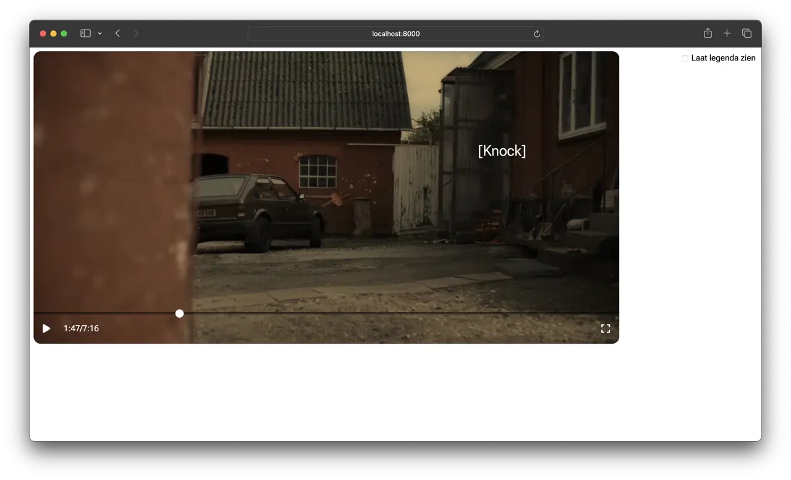 | 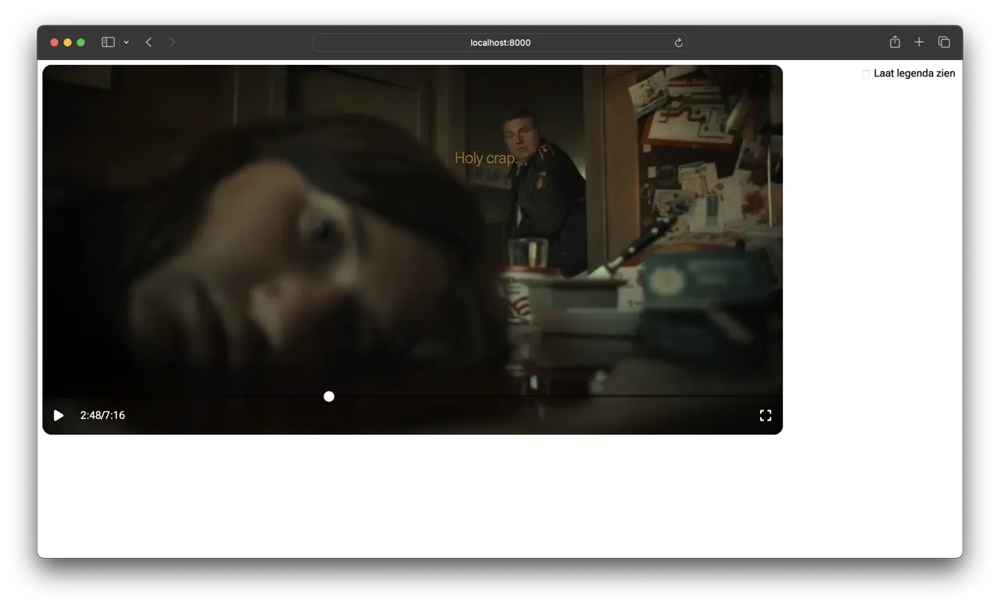 |
| --- | --- |

In dit tweede prototype heb ik een aantal verbeteringen doorgevoerd voor het uitdrukken van de emoties van personages in tekst. Daarnaast heb ik nieuwe experimenten gedaan met het toevoegen van *closed captions*.

### Verbeteringen
Om duidelijk te maken welke kleur bij welk personage hoort heb ik de eerste keer dat het personage voor komt de naam van het personage er bij gezet. Ook wanneer dit personage lang niets heeft gezegd staat de naam er opnieuw bij.

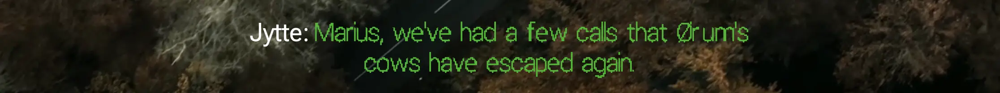

Verder kwam uit de test dat de opmaak van de gestresde tekst niet duidelijk was. Hiervoor heb ik een nieuwe versie gemaakt. Marie gaf zelf aan dat het goed zou zijn om het er de eerste keer bij te zetten, maar ik denk dat als het echt goed duidelijk is, dat helemaal niet nodig is. Dan is ook de legenda overbodig. Daarbij is het wel belangrijk om dit goed te testen.

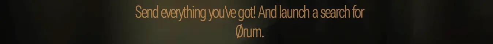

### Toevoegen van *closed captions*
Uit de test bleek dat alleen het dialoog voor Marie niet genoeg is. *Closed captions* is een toevoeging om ook geluiden te omschrijven. Uit het interview een week eerder bleek helaas dat dit vaak niet goed wordt gedaan. Het doel is om te testen wat hierin wel zou werken.

Ik heb op een aantal verschillende manieren *captions* toegevoegd. 

- Bestaande captions omschrijven vaak het geluid. Mijn idee was dat het veel leuker zou zijn om het geluid letterlijk op te schrijven. Zo staat bij de blaffende hond nu ```[woof]``` en bij de auto ```[wroom]```.
- Niet alle geluiden vond ik goed op te schrijven. Daarom heb ik sommige geluiden wel omschreven, zoals ```[car door opens]```. Uit de test moet blijken wat beter werkt.
- Wij kunnen makkelijk horen waar geluid vandaan komt, maar met *captions* is dat niet duidelijk. Daarom heb ik een overlay gemaakt, waarbij de *captions* over de video heen komen, op de plek waar het geluid vandaan komt. Dit zou natuurlijk als te druk kunnen worden ervaren.
- Hierin ben ik ook nog een stap verder gegaan, waarbij ik de *captions* mee animeer als de locatie van het geluid veranderd. In dit prototype is het goed te zien als de auto rijdt. Dit kan natuurlijk nog meer afleidend zijn.

Deze *captions* vallen helaas niet meer onder de standaard van *WebVTT*. Ze staan nog wel een *vtt*-bestand, maar met *HTML* elementen als de *ques*.

```html
7
00:01:11.291 --> 00:01:16.916
<div style="bottom: 35%; animation-name: carFirst; animation-duration: 4s;">[Wroom]</div>
```

Met *JavaScript* is het vervolgens simpel om de *ques* uit te lezen en als overlay toe te voegen.

```js
subtitles.addEventListener('cuechange', () => {
	if (subtitles.activeCues.length > 0) {
		p.innerHTML = subtitles.activeCues[0].text;
	} else {
		p.innerHTML = '';
	}
});
```

Om het compleet te maken, heb ik hier een *custom video player* omheen gezet, en de *controls* van de standaard *player* verborgen. Zo komen de *captions* ook mee op *full screen*.

## Feedback van Eric (12-04-2024)


## User test 2 (17-04-2024)

### Test plan
1. Ik heb twee stukjes film die ik ga laten zien waarin de verbeteringen goed zichtbaar zijn.
	- ```0:57 --> 3:36``` Hier zijn de *closed captions* goed te zien met animaties en posities.
	- ```4:11 --> 4:51``` Om de verbetering in het telefoongesprek te testen.
2. Daarna verteld Marie wat ze er van vindt.
3. Als laatste heb ik nog een aantal vragen:
	- Wat vind je van de teksten die op andere plekken in het scherm staan?
	- Zijn de omschreven geluiden, zoals bijvoorbeeld ```[Car door opens]``` duidelijk?
	- Heb je een idee wat het betekent als er bijvoorbeeld ```[Wroom]``` bij de auto, of ```[Woof]``` bij de hond staat?
	- Wat betekent de opmaak van de tekst ```It's the youngest. One of the two foster children.``` (4:22)?
	- Muziek mist nu nog en maakt het vaak de film spannend. Wat is voor jou spannend? Of: wat maakt jou bang?

### Notities
| 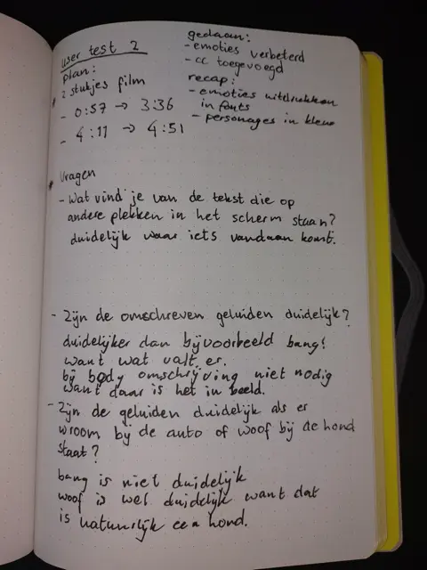 | 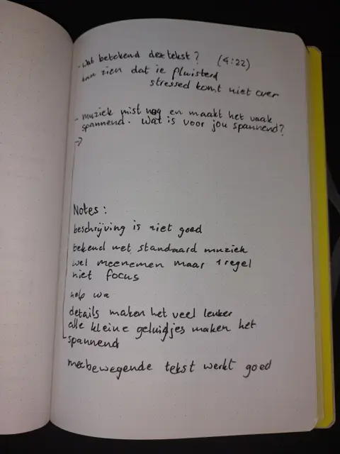 |
| --- | --- |
| 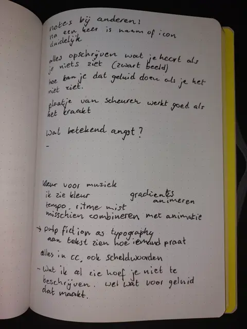 | 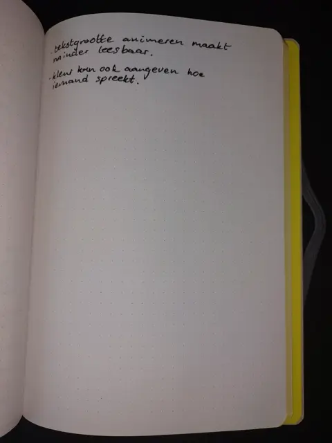 |

### Bevindingen
- De *closed captions* maken de ervaring veel beter! Alle kleine geluidjes zorgen voor spanning.
- Als een geluid heel specifiek is (```[woof]``` kan alleen maar een hond zijn) dan is een uitgeschreven geluid genoeg, maar bij minder specifieke geluiden is het nodig om ze te omschrijven. Als dit geluid in beeld duidelijk ook te zien is, is die beschrijving weer niet nodig.
- De positionering van de geluiden is wel fijn en maakt duidelijk waar geluiden vandaan komen.
- Het animeren van de positie van geluiden voegt wel wat toe, omdat het geluid ook verplaatst. Wel moet ik opletten dat de animatie niet de tekst onleesbaar maakt.
- Letters die groter en kleiner worden zijn niet goed leesbaar.
- De gestreste tekst komt nog steeds niet goed over. Er is wel duidelijk dat het gefluisterd wordt. De op elkaar gedrukte letters zijn wel nog goed leesbaar.
- Marie miste nog de muziek. Ze vroeg of er muziek in de scene zat, waarschijnlijk omdat er af en toe nog lange stiltes vielen.
- Muziek in alleen kleur uitdrukken werkt niet. Iedereen koppelt er namelijk andere kleuren aan. Een animatie met gradient voor vrolijke muziek werkt wel.

## Bronnen
- &lt;track&gt;: The Embed Text Track element. (2024, 14 maart). MDN Web Docs. https://developer.mozilla.org/en-US/docs/Web/HTML/Element/track
- Web Video Text Tracks Format (WebVTT). (2023, 26 november). MDN Web Docs. https://developer.mozilla.org/en-US/docs/Web/API/WebVTT_API